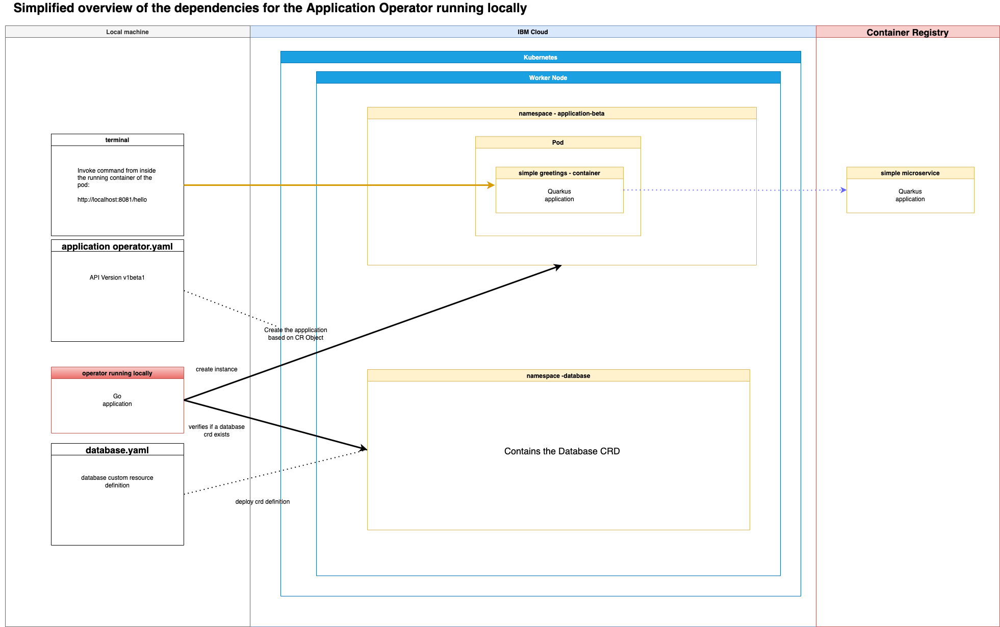

# Setup and local Usage

First install [prerequistes](Prerequisites.md)!

### Basic simplified architecture overview



### Navigate to operator-application

```sh
cd operator-application
```

### Create database resource

> Keep in mind: The`simple microservice` application will only becreated, if you deploy a `custom resource` of the `Application Operator` (you find an example `yaml` [here](./config/samples/application.sample_v1beta1_application.yaml)) and you need to deploy the `Custom Resource Definion` of the `Database Operator` (you find [here](../operator-database/config/crd/bases/database.sample.third.party_databases.yaml). Because, the `Application Operator` validates, if there is a `Custom Resource Definion` in a namespace called `database`.

* Create a namespace for the `Database Operator`

```sh
kubectl create namespace database
```

* Create the `Custom Resource Definition` for the `Database Operator`

```sh
kubectl apply -f ../operator-database/config/crd/bases/database.sample.third.party_databases.yaml
```

### Run operator locally

We will start two terminals:

#### Step 1: From a terminal run this command to run the operator locally:

```sh
make generate
make manifests
make install run ENABLE_WEBHOOKS=false
```

>  🔴 IMPORTANT - Known issue: The repo has been tested with **operator-sdk v1.18.1**. Note that there is an issue with this version. It doesn't download the **tools** in the **'bin'** directory. You need to init a new temporary new project for example `operator-sdk init --domain example.com --repo github.com/example/memcached-operator` and copy the downloaded four files from the 'bin' directoy into both operators directories (Application Operator and the Database Operator).

#### Step 2: From another terminal run this command to deploy a custom resource inside the Kubernetes cluster (ensure you are in `operator-application` directory):

```sh
kubectl apply -f config/samples/application.sample_v1beta1_application.yaml
```

#### Step 3: Go back to the first terminal and verify the output

You should see the operator was creating resources.

* Example output:

```sh
1.6509813066540182e+09  INFO    controller.application    Reconcile started       {"reconciler group": "application.sample.ibm.com", "reconciler kind": "Application", "name": "application", "namespace": "application-beta"}
Kubernetes Server Version: v1.23.5+IKS
Custom Resource Values:
- Name: application
- Namespace: application-beta
- Version: 1.0.0
- AmountPods: 1
- DatabaseName: database
- DatabaseNamespace: database
1.650981308668996e+09   INFO    controller.application    Database resource database not found. Creating or re-creating database    {"reconciler group": "application.sample.ibm.com", "reconciler kind": "Application", "name": "application", "namespace": "application-beta"}
```

#### Step 4: Go back to the second terminal and verify the setup

Run following commands

* Get the `Custom Resource Definition` for the `Application Operator`

```sh
kubectl get applications.application.sample.ibm.com/application -n application-beta -oyaml
```

* Example output:

```sh
apiVersion: application.sample.ibm.com/v1beta1
kind: Application
metadata:
  annotations:
    kubectl.kubernetes.io/last-applied-configuration: |
      {"apiVersion":"application.sample.ibm.com/v1beta1","kind":"Application","metadata":{"annotations":{},"name":"application","namespace":"application-beta"},"spec":{"amountPods":1,"databaseName":"database","databaseNamespace":"database","title":"movies","version":"1.0.0"}}
  creationTimestamp: "2022-04-26T13:55:06Z"
  generation: 1
  name: application
  namespace: application-beta
  resourceVersion: "6642069"
  uid: b69b86c5-9a11-46d5-8126-a03fbcad5d87
spec:
  amountPods: 1
  databaseName: database
  databaseNamespace: database
  schemaUrl: https://raw.githubusercontent.com/IBM/multi-tenancy/main/installapp/postgres-config/create-populate-tenant-a.sql
  title: movies
  version: 1.0.0
status:
  conditions:
  - lastTransitionTime: "2022-04-26T13:55:06Z"
    message: Resource found in k18n
    reason: ResourceFound
    status: "True"
    type: ResourceFound
  - lastTransitionTime: "2022-04-26T13:55:08Z"
    message: All requirements met, attempting install
    reason: AllRequirementsMet
    status: "True"
    type: InstallReady
  - lastTransitionTime: "2022-04-26T13:55:09Z"
    message: The database exists
    reason: DatabaseExists
    status: "True"
    type: DatabaseExists
  - lastTransitionTime: "2022-04-26T13:55:09Z"
    message: Application has been installed
    reason: InstallSucceeded
    status: "True"
    type: Succeeded
  schemaCreated: false
```

* Execute the curl command from inside the running pod of the `application-microservice`

```sh
kubectl exec -n application-beta $(kubectl get pods -n application-beta | awk '/application-deployment-microservice/ {print $1;exit}') --container application-microservice -- curl -s http://localhost:8081/hello
```

* Example output:

```sh
Hello World
```

### Step 5: (Optional) Debug the operator (without webhooks):

To debug, press F5 (Run - Start Debugging) instead of 'make install run'. The directory 'operator-application' needs to be root in VSCode.

### Step 6: Delete the `simple microservice` instance

```sh
kubectl delete -f config/samples/application.sample_v1beta1_application.yaml
```

* Example output:

```sh
namespace "application-beta" deleted
application.application.sample.ibm.com "application" deleted
```

### Step 7: Stop the execution in the first terminal

### Step 8: Uninstall the Application Operator components

```sh
make uninstall
```

* Example output:

```sh
operator-application/bin/controller-gen rbac:roleName=manager-role crd webhook paths="./..." output:crd:artifacts:config=config/crd/bases
/Users/thomassuedbroecker/Downloads/dev/operator-sample-go/operator-application/bin/kustomize build config/crd | kubectl delete --ignore-not-found=false -f -
customresourcedefinition.apiextensions.k8s.io "applications.application.sample.ibm.com" deleted
```

### Step 9: Delete the database operator custom resource definition

```sh
kubectl delete -f ../operator-database/config/crd/bases/database.sample.third.party_databases.yaml
kubectl delete namespace database
```

* Example output:

```sh
customresourcedefinition.apiextensions.k8s.io "databases.database.sample.third.party" deleted
namespace "database" deleted
```