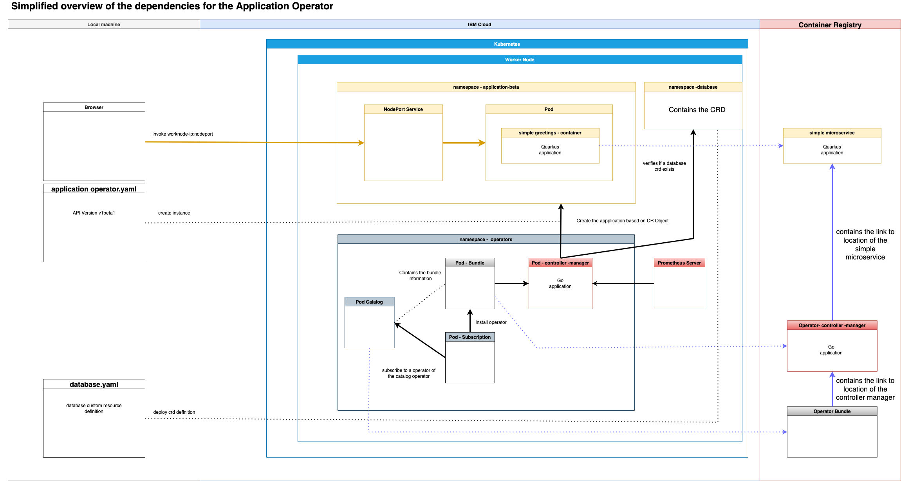

# Application Operator

See project [readme](../README.md).

### Basic overview of the Application Operator

The current Application Operator implementation includes following features:

* Webhook to update older API versions of the operator
* [Monitoring and metrics](./controllers/application/monitor.go)
* [Verify Kubernetes versions](./controllers/application/prerequisites.go) 
* Deploys the [simple microservice](../simple-microservice/) application with related Kubernetes objects to access the application from the internet
* Delete the [simple microservice](../simple-microservice/) application with related Kubernetes objects to access the `simple microservice` from the internet
* Verifies if the custom resource definition of the [Database Operator](../operator-database/README.md) exists

### Simplified architecture overview 

#### 1. Kubernetes deployment

The following simplifed diagram shows:

* The local machine invokation of the simple mircoservice endpoint and the needed custom resources files to create an instance of the `simple mircoservice` application by the `Application Operator`.

* The simplified usage of the Kubernetes service on IBM Cloud

* The `namespaces`, `pods` and `container registry` with their main depencencies

### Current configurations of the `Application Operator`

The `Application Operator` currently as two different API versions.

* [v1alpha1](operator-application/api/v1alpha1)
* [v1beta1](operator-application/api/v1beta1)

The latest operator implementation uses the [v1beta1](operator-application/api/v1beta1) API.

